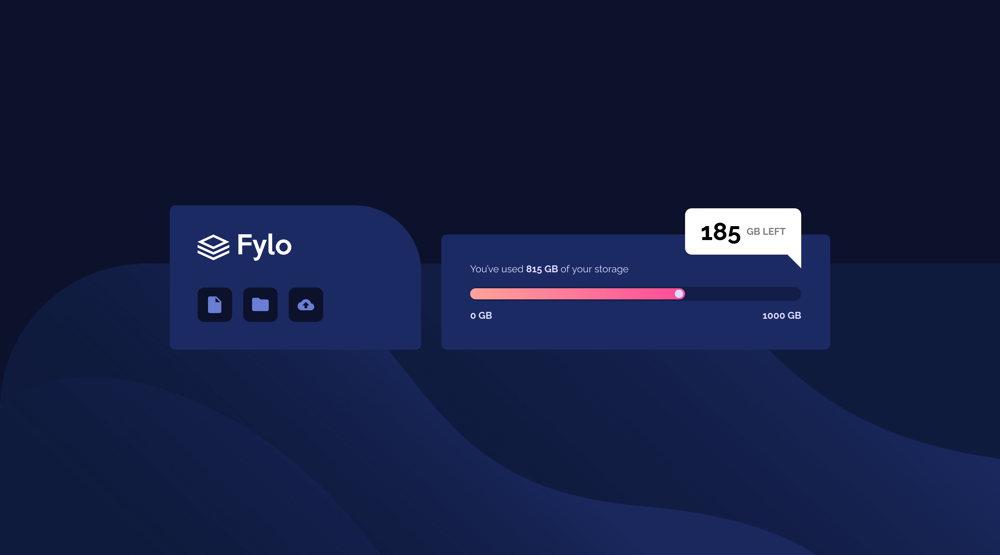

# Frontend Mentor - Fylo data storage component solution

This is a solution to the [Fylo data storage component challenge on Frontend Mentor](https://www.frontendmentor.io/challenges/fylo-data-storage-component-1dZPRbV5n). Frontend Mentor challenges help you improve your coding skills by building realistic projects.

## Table of contents

- [Overview](#overview)
  - [The challenge](#the-challenge)
  - [Screenshot](#screenshot)
  - [Links](#links)
- [My process](#my-process)
  - [Built with](#built-with)
  - [What I learned](#what-i-learned)
  - [Continued development](#continued-development)
  - [Useful resources](#useful-resources)
- [Author](#author)

## Overview

### The challenge

Users should be able to:

- View the optimal layout for the site depending on their device's screen size

### Screenshot

### Links

- Solution URL: [My Solution](https://your-solution-url.com)
- Live Site URL: [Live](https://matiasbastarrica.github.io/fylo-data-storage-component/)

## My process

### Built with

- Semantic HTML5 markup
- CSS custom properties
- Flexbox
- Mobile-first workflow

### What I learned

I learned how to make a right-angled triangle in CSS

### Continued development

I'd like to continue to work on positioning elements on the page using position absolute and position relative.

### Useful resources

- [How to Draw a Right-Angled Triangle with CSS](https://www.youtube.com/watch?v=tTNxykEAPpA) - This video help me to create the decorative triangle for the "bubble" element.

## Author

- Frontend Mentor - [@MatiasBastarrica](https://www.frontendmentor.io/profile/MatiasBastarrica)
